<p align="center">
  
</p>

<h1 align="center">Sipzy</h1>

<p align="center">
  <strong>Watch-to-Trade: The Creator Token Economy Platform</strong>
</p>

<p align="center">
  A decentralized platform where fans can buy and sell creator tokens through linear bonding curves while watching YouTube content, with premium features gated via x402 micropayments.
</p>

<p align="center">
  <a href="#features">Features</a> •
  <a href="#how-it-works">How It Works</a> •
  <a href="#tech-stack">Tech Stack</a> •
  <a href="#getting-started">Getting Started</a> •
  <a href="#architecture">Architecture</a> •
  <a href="#api-reference">API</a> •
  <a href="#contributing">Contributing</a>
</p>

---

## 🎯 Overview

**Sipzy** revolutionizes creator monetization by combining:

- **🎬 Watch-to-Trade** — Trade creator tokens while watching YouTube content
- **📈 Linear Bonding Curves** — Fair, transparent pricing with `Price = (Supply × 0.0001) + 0.01 SOL`
- **⚡ Solana Blinks** — Trade directly from X/Twitter through Solana Actions
- **💰 x402 Micropayments** — Premium content access via HTTP 402 payment protocol
- **🔗 On-chain Transparency** — All trades verified on Solana blockchain

---

## ✨ Features

### Core Trading Engine
- **Linear Bonding Curve** — Predictable pricing that increases with demand
- **Instant Liquidity** — Buy and sell tokens anytime, no orderbooks
- **1% Creator Fee** — Creators earn from every trade automatically
- **Pool Per Video** — Each YouTube video has its own token pool

### Solana Actions (Blinks)
- **Shareable Trade Links** — Generate URLs for trading on any platform
- **Twitter Integration** — Trade creator tokens directly from X/Twitter
- **No Wallet Required** — Non-custodial trading via Action providers

### x402 Payment Gates
- **Micropayment Access** — Premium content for as low as $0.01
- **USDC Payments** — Stable cryptocurrency payments on Solana
- **Session Management** — Automatic access after payment verification

### User Experience
- **Wallet Integration** — Phantom, Solflare, and 20+ wallets supported
- **Real-time Updates** — Live price and supply tracking
- **Responsive Design** — Works on desktop and mobile

---

## 🔄 How It Works

### System Architecture Flow

```mermaid
flowchart TB
    subgraph Users["👥 Users"]
        Fan[("🎧 Fan/Investor")]
        Creator[("🎬 Creator")]
    end

    subgraph Frontend["🖥️ Next.js Frontend"]
        Landing["/ Landing Page"]
        Dashboard["/dashboard Creator Panel"]
        Watch["/watch/:id Video Page"]
        Trade["/creator/:id Trading Page"]
    end

    subgraph Backend["⚙️ API Layer"]
        Auth["/api/auth/* Wallet Auth"]
        Actions["/api/actions/* Solana Blinks"]
        CreatorAPI["/api/creator/* Profile/Videos"]
        Discover["/api/discover/* Browse Content"]
    end

    subgraph Blockchain["⛓️ Solana Blockchain"]
        Program["📜 Sipzy Vault Program"]
        CreatorPool["Creator Pool PDA"]
        StreamPool["Stream Pool PDA"]
    end

    subgraph External["🌐 External Services"]
        YouTube["📺 YouTube API"]
        Phantom["👛 Phantom Wallet"]
        X402["💳 x402 Payments"]
    end

    Fan --> Landing
    Fan --> Watch
    Fan --> Trade
    Creator --> Dashboard
    
    Dashboard --> Auth
    Dashboard --> CreatorAPI
    Dashboard --> YouTube
    
    Watch --> Discover
    Trade --> Actions
    Trade --> Program
    
    Actions --> Program
    Program --> CreatorPool
    Program --> StreamPool
    
    Phantom --> Program
    X402 --> Backend
```



### Creator Onboarding Flow


### Token Trading Flow

```mermaid
sequenceDiagram
    participant User as 👤 User
    participant App as 🖥️ Sipzy App
    participant Wallet as 👛 Phantom
    participant Solana as ⛓️ Solana

    User->>App: Select token amount to buy
    App->>App: Calculate cost via bonding curve
    App->>User: Display: "Buy 10 tokens for 0.15 SOL"
    User->>App: Confirm purchase
    App->>Wallet: Request transaction signature
    Wallet->>User: "Approve transaction?"
    User->>Wallet: ✅ Approve
    Wallet->>Solana: Submit signed transaction
    Solana->>Solana: Execute buy_tokens instruction
    Solana->>Solana: Update pool state (supply, reserve)
    Solana->>Solana: Transfer 1% fee to creator
    Solana-->>App: Transaction confirmed
    App-->>User: 🎉 "You now own 10 tokens!"
```



### Bonding Curve Mechanics


### Solana Blinks (Actions) Flow


### x402 Premium Content Flow

```mermaid
sequenceDiagram
    participant User as 👤 User
    participant App as 🖥️ Sipzy
    participant Middleware as 🔒 x402 Middleware
    participant Payment as 💳 Payment Provider

    User->>App: Request premium content
    App->>Middleware: Check access
    Middleware->>Middleware: No valid session found
    Middleware-->>User: 402 Payment Required
    User->>Payment: Pay 0.01 USDC
    Payment->>Payment: Process payment on Solana
    Payment-->>Middleware: Payment confirmed
    Middleware->>Middleware: Create access session
    Middleware-->>App: Grant access
    App-->>User: 🎬 Premium content unlocked!
```



### Pool State Diagram


### Database Entity Relationships


---

## 🛠 Tech Stack

| Layer | Technology |
|-------|------------|
| **Blockchain** | Solana (Devnet/Mainnet) |
| **Smart Contract** | Anchor Framework (Rust) |
| **Frontend** | Next.js 16, React 19, TypeScript |
| **Styling** | Tailwind CSS 4 |
| **Wallet** | Solana Wallet Adapter |
| **Payments** | x402 Protocol (USDC) |
| **Actions** | Solana Actions/Blinks |

---

## 🚀 Getting Started

### Prerequisites

- Node.js 18+
- pnpm 8+
- Rust (latest stable)
- Solana CLI 1.18+
- Anchor CLI 0.30.1

### Quick Start

```bash
# Clone the repository
git clone https://github.com/your-username/sipzy.git
cd sipzy

# Install dependencies
pnpm install

# Copy environment file
cp .env.example .env.local

# Build the Anchor program
anchor build

# Run tests
anchor test

# Start development server
pnpm dev
```

### Environment Setup

Create `.env.local` with your configuration:

```env
# Solana Program ID (from anchor build)
NEXT_PUBLIC_PROGRAM_ID=22RS3cJfjadwGqLdqCTJ4xfYRbjA5n4baamC28v8675r

# Treasury wallet for fee collection
NEXT_PUBLIC_TREASURY_ADDRESS=your_treasury_wallet

# RPC URL
NEXT_PUBLIC_RPC_URL=https://api.devnet.solana.com

# x402 Configuration
NEXT_PUBLIC_RECEIVER_ADDRESS=your_receiver_wallet
NEXT_PUBLIC_NETWORK=solana-devnet
NEXT_PUBLIC_CDP_CLIENT_KEY=your_cdp_key
```

See [`.env.example`](.env.example) for all configuration options.

### Deploy to Devnet

```bash
# Configure Solana CLI
solana config set --url devnet

# Airdrop SOL for deployment
solana airdrop 2

# Deploy program
anchor deploy
```

---

## 📁 Architecture

```
sipzy/
├── app/                          # Next.js App Router
│   ├── api/
│   │   └── actions/
│   │       ├── route.ts          # Actions discovery
│   │       └── trade/
│   │           └── route.ts      # Blink trading endpoint
│   ├── watch/
│   │   └── [id]/
│   │       ├── page.tsx          # Watch & trade page
│   │       └── premium/
│   │           └── page.tsx      # x402 gated content
│   └── page.tsx                  # Landing page
├── components/
│   ├── providers/
│   │   └── wallet-provider.tsx   # Solana wallet context
│   ├── trading-sidebar.tsx       # Trading widget
│   └── youtube-player.tsx        # Video embed
├── lib/
│   ├── idl/
│   │   └── sipzy_vault.json      # Anchor IDL
│   └── program.ts                # Program utilities
├── programs/
│   └── sipzy_vault/
│       └── src/
│           └── lib.rs            # Anchor program (Rust)
├── tests/
│   └── sipzy_vault.ts            # Integration tests
├── middleware.ts                 # x402 payment middleware
├── Anchor.toml                   # Anchor configuration
└── package.json
```

---

## 📡 API Reference

### Solana Actions Endpoints

#### GET `/api/actions/trade`
Returns action metadata for the trading interface.

```json
{
  "icon": "https://sipzy.app/icon.png",
  "title": "Trade Creator Tokens",
  "description": "Buy or sell tokens on the bonding curve",
  "label": "Trade",
  "links": {
    "actions": [
      { "label": "Buy 1", "href": "/api/actions/trade?id={id}&action=buy&amount=1" },
      { "label": "Buy 5", "href": "/api/actions/trade?id={id}&action=buy&amount=5" }
    ]
  }
}
```

#### POST `/api/actions/trade`
Creates a transaction for buying/selling tokens.

**Request:**
```json
{
  "account": "user_wallet_pubkey"
}
```

**Response:**
```json
{
  "transaction": "base64_encoded_transaction",
  "message": "Buy 5 tokens for 0.055 SOL"
}
```

---

## 🧪 Testing

```bash
# Run all tests
anchor test

# Run specific test file
pnpm test tests/sipzy_vault.ts

# Run with verbose output
anchor test -- --verbose
```

### Test Coverage

| Test | Description |
|------|-------------|
| `Initializes a pool` | Creates new pool for YouTube video |
| `Buys tokens` | Purchases tokens via bonding curve |
| `Gets current price` | Reads price from curve |
| `Sells tokens` | Sells tokens back to curve |

---

## 🔐 Security Considerations

- **Auditing** — Smart contract should be audited before mainnet deployment
- **Rate Limiting** — Implement rate limits on API endpoints
- **Input Validation** — All user inputs are validated on-chain
- **PDA Security** — Pool accounts use Program Derived Addresses
- **Overflow Protection** — All arithmetic uses checked operations

---

## 🗺 Roadmap

- [x] Linear bonding curve implementation
- [x] Solana Actions/Blinks support
- [x] x402 micropayment integration
- [x] Wallet adapter integration
- [ ] Creator verification system
- [ ] Multi-token support (SPL tokens)
- [ ] Advanced analytics dashboard
- [ ] Mobile app (React Native)
- [ ] DAO governance for protocol upgrades

---

## 🤝 Contributing

Contributions are welcome! Please read our contributing guidelines before submitting PRs.

1. Fork the repository
2. Create your feature branch (`git checkout -b feature/amazing-feature`)
3. Commit your changes (`git commit -m 'Add amazing feature'`)
4. Push to the branch (`git push origin feature/amazing-feature`)
5. Open a Pull Request

---

## 📄 License

This project is licensed under the MIT License - see the [LICENSE](LICENSE) file for details.

---

## 🙏 Acknowledgments

- [Solana](https://solana.com/) — High-performance blockchain
- [Anchor](https://anchor-lang.com/) — Solana development framework
- [x402](https://x402.org/) — HTTP payment protocol
- [Coinbase](https://www.coinbase.com/) — CDP and payment infrastructure

---

<p align="center">
  <strong>Built with ❤️ for the Creator Economy</strong>
</p>

<p align="center">
  <a href="https://twitter.com/sipzy">Twitter</a> •
  <a href="https://discord.gg/sipzy">Discord</a> •
  <a href="https://sipzy.app">Website</a>
</p>
